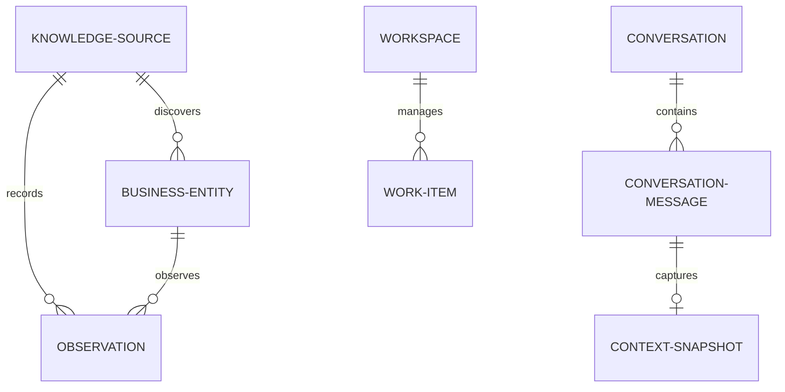

# BUSINESS OS SYSTEM SPECIFICATION (AI CHIEF OF STAFF)

This specification outlines the architecture, database schema, and data workflow for BusinessOS—a local-first, privacy-respecting AI Chief of Staff for solo founders.

---

## 1. System Architecture

BusinessOS runs entirely locally on the founder's machine. It consists of a React/Next.js frontend, a Fastify local backend, and a local SQLite workspace model.

```mermaid
graph TD
    Browser[Browser / Next.js UI]
    Fastify[Local Fastify Server]
    EventBus[Event Bus (Analytics)]
    ContextBuilder[Brain Context Builder]
    Registry[Knowledge Source Registry]
    SQLite[(SQLite: database.sqlite)]

    Browser <-->|HTTP / WebSockets| Fastify
    Fastify -->|Publishes Events| EventBus
    Fastify -->|Invokes| ContextBuilder
    Fastify -->|Syncs via| Registry
    ContextBuilder -->|Queries| SQLite
    Registry -->|Persists to| SQLite
```

---

## 2. Directory Structure (pnpm Workspace Monorepo)

```text
business-os/
├── apps/
│   ├── web/                    # Next.js Frontend (Conversation & Work panels)
│   └── server/                 # Fastify Backend (Event Bus, Context Builder, API router)
│
├── packages/
│   ├── ui/                     # Shared design system components
│   ├── sdk/                    # Shared client API bindings
│   ├── workspace/              # Workspace lifecycle SDK (open/close, SQLite Drizzle connection)
│   ├── brain-sdk/              # LLM integration (OpenRouter free models)
│   ├── connector-sdk/          # Standardized Knowledge Source ingestion engine
│   └── shared/                 # Shared types, Zod schemas, and Event Bus
│
├── workspace/                  # Test workspace
└── tsconfig.json               # Strict TypeScript configuration
```

---

## 3. Database Schema (Drizzle ORM)

The SQLite database acts as a relational store for business objects, observations, conversation sessions, and work items. Marketing terms are abstracted to canonical business primitives.



### Table Definitions

1.  **`knowledge_sources`** (formerly data_sources):
    - Tracks third-party connections (e.g. Gmail, Instagram, manual PDFs).
    - Columns: `id`, `workspaceId`, `connectorId`, `status`, `displayName`, `authContext` (secure JSON credentials), `lastSyncAt`.
2.  **`business_entities`**:
    - Unified representation of any business unit (e.g., campaign, email contact, product, task).
    - Columns: `id`, `workspaceId`, `sourceId` (references knowledge_sources), `externalId`, `type` ("campaign", "email", "product", "contact"), `name`, `status`, `createdAt`, `updatedAt`, `attributes` (JSON metadata).
3.  **`observations`** (formerly timeSeriesMetrics):
    - Decoupled records of values observed over time (e.g., ad click count, email open rate, page views, revenue).
    - Columns: `id`, `workspaceId`, `sourceId`, `entityId` (references business_entities, nullable), `date` (UTC), `originalTimezone`, `observationType` ("clicks", "opens", "page_views", "revenue"), `value` (real), `currency`.
4.  **`work_items`**:
    - First-class tasks managed or executed by the AI Chief of Staff or the founder.
    - Columns: `id`, `workspaceId`, `title`, `status` ("pending", "in_progress", "completed", "failed"), `type` ("analysis", "recommendation_execution", "manual_task", "automation"), `assignedTo` ("ai", "founder"), `details` (JSON attributes), `createdAt`, `updatedAt`.
5.  **`conversations`**:
    - A chat session containing context memory.
    - Columns: `id`, `workspaceId`, `title`, `createdAt`, `updatedAt`.
6.  **`conversation_messages`**:
    - Individual message exchanges.
    - Columns: `id`, `conversationId` (references conversations), `role` ("user", "assistant", "system"), `content`, `createdAt`.
7.  **`context_snapshots`**:
    - Saves the working memory state built by the Context Builder at a specific message step, allowing the user to resume chat threads accurately.
    - Columns: `id`, `messageId` (references conversation_messages), `snapshot` (JSON context payload), `createdAt`.

---

## 4. Knowledge Source Lifecycle (`packages/connector-sdk`)

Every knowledge source provider implements a standardized six-step lifecycle:

```typescript
export interface IKnowledgeSourceProvider<
  TConfig,
  TRawPayload,
  TNormalizedData,
> {
  config: {
    connectorId: string;
    displayName: string;
  };

  // 1. Authenticate connection (OAuth token validation or API key verification)
  authenticate(credentials: unknown): Promise<TConfig>;

  // 2. Discover available assets/entities (e.g. Facebook pages, email threads)
  discover(authContext: TConfig): Promise<unknown>;

  // 3. Extract raw payloads from target APIs
  sync(authContext: TConfig, lastSyncAt?: Date): Promise<TRawPayload>;

  // 4. Map external models into our canonical BusinessEntity and Observation structures
  normalize(rawPayload: TRawPayload): Promise<TNormalizedData>;

  // 5. Validate the normalized output matches strict schemas (Zod)
  validate(normalizedData: TNormalizedData): Promise<boolean>;

  // 6. Persist results safely into SQLite via transaction
  persist(db: any, data: TNormalizedData): Promise<void>;
}
```

---

## 5. Brain Context Builder Layer

The AI model never reads the database directly. Instead, the `BrainContextBuilder` handles retrieval, ensuring token efficiency and high accuracy:

1.  **Intent Detection:** Analyzes the founder's message to identify key entities, timeframe, and goals.
2.  **Context Assembly:** Queries SQLite for relevant `business_entities` and chronological `observations`.
3.  **Prompt Enrichment:** Packages the pruned context and recent `conversation_messages` into the model prompt.
4.  **Snapshotting:** Saves the working context as a `context_snapshot` to maintain thread memory.

---

## 6. Product Analytics Event Bus

To keep event tracking decoupled:

1.  **Publishers:** Fastify routes and workspace SDKs emit events to a central, local `EventBus` module.
2.  **Subscribers:** The `AnalyticsEngine` subscribes to the event bus and records execution metrics (e.g. sync performance, chat latency) in the `analytics_events` table.

```typescript
export interface AnalyticsEvent {
  sessionId: string;
  eventName: string;
  category: "Acquisition" | "Activation" | "Engagement" | "Friction";
  properties?: Record<string, unknown>;
}

// Example usage:
// eventBus.publish("sync_started", { category: "Activation", properties: { provider: "instagram" } });
```

---

## 7. Definition of Done (Founder Dogfooding Build)

To verify usability:

- [ ] Real OAuth credentials sync dynamically without fallback mocks.
- [ ] The chatbot uses function-calling / structured tool queries to retrieve data.
- [ ] The UI contains a functional Work Item dashboard showing pending, active, and completed AI actions.
- [ ] Conversation history is saved, reloadable, and references correct thread snapshots.
- [ ] Build completes with zero TypeScript compile errors.
