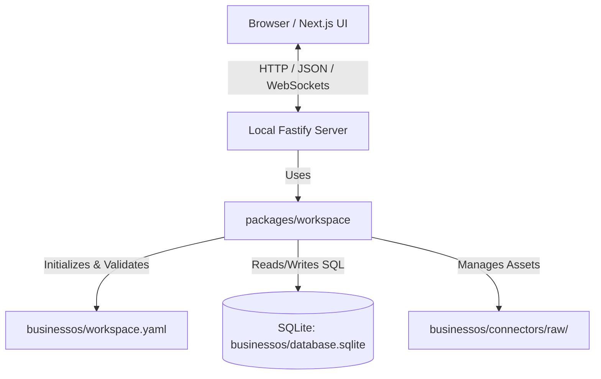
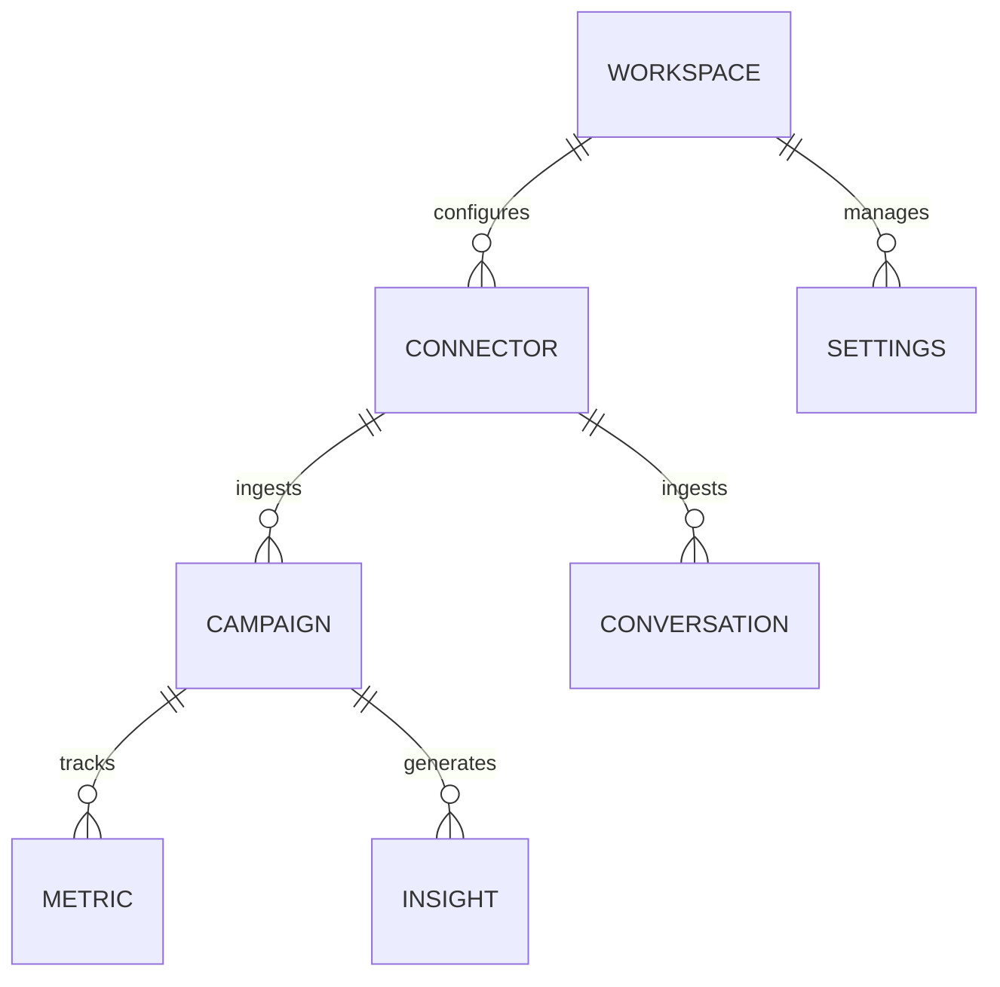
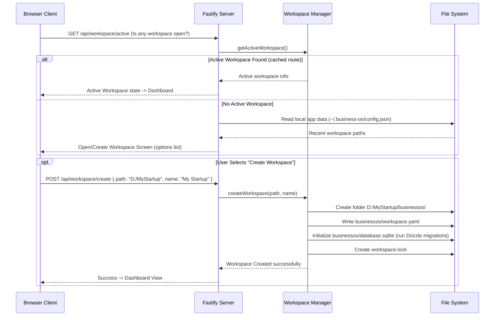

# BUSINESS OS MVP SPECIFICATION

This specification outlines the architecture, data structures, and implementation workflow for the local-first Business OS MVP (V1).

---

## 1. System Architecture

Business OS runs entirely locally on the user's computer. It consists of a React/Next.js frontend, a Fastify local backend, and a file-system-based workspace model using SQLite.



---

## 2. Directory Structure (pnpm Workspace Monorepo)

```text
business-os/
├── apps/
│   ├── web/                    # Next.js Frontend (Tailwind CSS v4, Lucide React, shadcn/ui)
│   └── server/                 # Fastify Backend (better-sqlite3, Drizzle ORM, fastify-type-provider-zod)
│
├── packages/
│   ├── ui/                     # Shared UI components (shadcn/ui skeleton)
│   ├── sdk/                    # Shared TypeScript Client SDK
│   ├── workspace/              # Workspace lifecycle SDK (create, open, validate, migrator)
│   ├── brain-sdk/              # Decoupled LLM abstraction (Gemini, OpenRouter, Ollama)
│   ├── connector-sdk/          # scheduled importer connector engine (Instagram, Gmail, Google Ads, Website)
│   ├── context-engine/         # Local context processor
│   ├── visualization/          # Chart builders (Apache ECharts)
│   └── shared/                 # Shared types, Zod schemas, & utility functions
│
├── workspace/                  # Sample local workspace for developer testing
├── package.json                # Monorepo root package JSON
├── pnpm-workspace.yaml         # pnpm workspace definition
└── tsconfig.json               # Strict root TypeScript configuration
```

---

## 3. Workspace Layout

A workspace corresponds to a folder owned by the user. Inside that folder, Business OS isolates its system files under a `businessos/` directory.

```text
User Chosen Directory/  (e.g. D:\Business\My Startup\)
└── businessos/
    ├── workspace.yaml       # Workspace manifest metadata
    ├── database.sqlite      # Workspace local SQLite database
    ├── settings.json        # Workspace credentials & configuration (local, gitignored)
    ├── workspace.lock       # Prevents double-opening of the database
    ├── connectors/          # Raw snapshots downloaded by connectors
    │   ├── instagram/
    │   └── gmail/
    ├── generated/           # Sync reports, logs, and exports
    ├── uploads/             # User-uploaded files and media
    └── cache/               # Temporary caching directory
```

---

## 4. Database Schema (Drizzle ORM)

The SQLite database acts as a relational store for normalized **business objects** and system configurations.



### Table Definitions
1. **`workspace`**: Holds metadata, schema version, and base configurations.
2. **`settings`**: User-specific configuration (sync preferences, user details).
3. **`connector`**: Active connectors, credential identifiers (vault mapping), status.
4. **`campaign`**: Standardized marketing campaigns (name, platform, status).
5. **`metric`**: Normalized daily metrics (reach, clicks, conversions, spend, CTR) linked to campaigns.
6. **`conversation`**: Key email conversations or lead messages.
7. **`insight`**: System-generated insights and reasoning logs.

---

## 5. Startup & Initialization Lifecycle

When the application launches, it attempts to load the most recent workspace. If none exists, it displays the welcome and workspace selection screen.



---

## 6. Development Workflow (Sprint 000 Foundation)

Sprint 000 deliverables establish this foundation:
1. **Monorepo setup**: Configure workspace `pnpm`, root `package.json`, and root `tsconfig.json`.
2. **`packages/shared`**: Initialize Zod schemas and type exports for Workspace configurations.
3. **`packages/workspace`**: Implement workspace creation, loading, lock creation, and structure validation.
4. **`apps/server`**: Set up a Fastify server using strict TypeScript, fastify-type-provider-zod, and better-sqlite3 connection to the workspace database.
5. **`apps/web`**: Set up Next.js app with Tailwind CSS v4, workspace selector landing page, and a basic system health dashboard showing active workspace stats.
